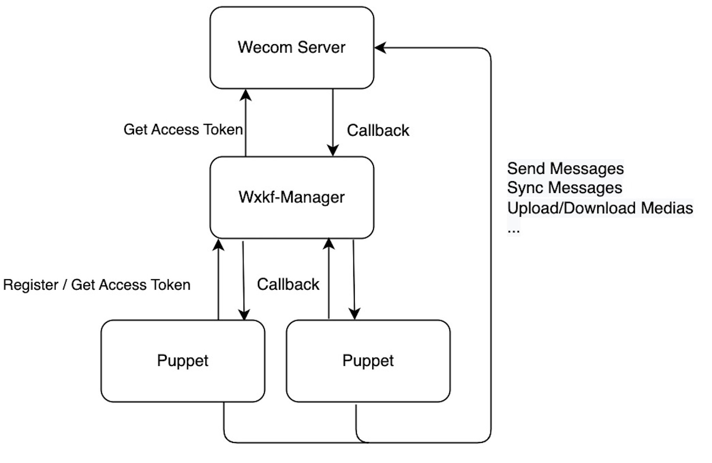
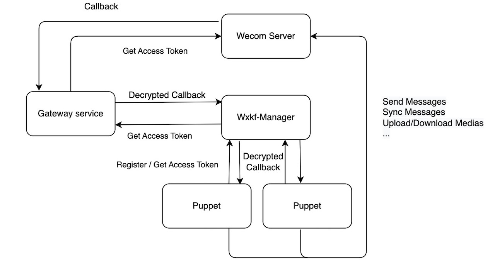

# WECHATY PUPPET WXKF
A manager for wechaty-puppet-wxkf.

## Why do we need this manager?

Either In-house development app and Authorize custom app can take many responsibilities, and WXKF might be just one of them. Also you might create multiple WXKF accounts. So it is almost a must for there to be a manager to listen and dispatch callbacks. That's why we need WXKF-Manager.

To use WXKF-Manager, you need to set up two more envs in your WXKF bot implementation, PUPPET_WXKF_MANAGER_CENTER_ENDPOINT and PUPPET_WXKF_SELF_ENDPOINT.

```bash
export PUPPET_WXKF_MANAGER_ENDPOINT=http://127.0.0.1:7777
export PUPPET_WXKF_SELF_ENDPOINT=http://127.0.0.1:8080
```

PUPPET_WXKF_MANAGER_ENDPOINT is the endpoint of WXKF-Manager, puppet will register to this manager with kfId and PUPPET_WXKF_SELF_ENDPOINT so that the manager will callback to puppet when receiving new events.

## Structure

This is the simplest structure when you have only have WXKF to handle in your wecom corp app.



## How to use

### Requirements

- Mongo db access to store registered puppets

### Implementation

Typically you can build this into a docker image and implement.

### Set up

Envs:

``` bash
export MONGO_URI=mongodb://127.0.0.1:27017/wxkf-manager
export PORT=7777
# export ACCESS_TOKEN_URL=https://127.0.0.1:8888/api/corp/accessToken
```

MONGO_URI: the endpoint of mongo db
PORT: the port that manager http server listens to
ACCESS_TOKEN_URL: This is optional. 

Note: When decrypting callback messages from wecom server, we need to use encodingAESKey and token. And this information cannot be retrieved before the first token from that corp registered in this manager.

### Best Practice

The above approach will work, but that is not the best practice. The problem is: the access token of the app is key to all Wecom APis, and Wecom claims that there is a limit on calling this API. So there better be a service to renew and cache this token.



In this structure, instead of receiving the callback directly from Wecom, a gateway service should be implemented to handle all services. The callback address of wecom should be `http://www.example.com/callback/{corpId}`. It's db should have the encodingAesKey and token of that corp. So it can decrypt the message and handle it correctly.

When the gateway service receive a `kf_msg_or_event` callback, it can call the WXKF-Manager service and it then dispatch the message to the corresponding puppet.

WXKF-Manager can receive either decrypted JSON message or crypted XML message (as it is from Wecom). e.g.:

decrypted message:
```ts
const url = `${PUPPET_WXKF_MANAGER_ENDPOINT}/callback/decrypted/${corpId}`

axios.post(url, {
  token: 'xxx', // this token is not the token of wecom corp app, it is the token for sync messages. see https://kf.weixin.qq.com/api/doc/path/94745
  openKfId: 'xxx',
})
```

crypted message:
```ts
const url = `${PUPPET_WXKF_MANAGER_ENDPOINT}/callback/${corpId}`

axios.post(url, xmlString, { // xmlString is the raw crypted message directly from wecom callback body`
  headers: {
    'Content-type': 'text/xml'
  }
})
```
